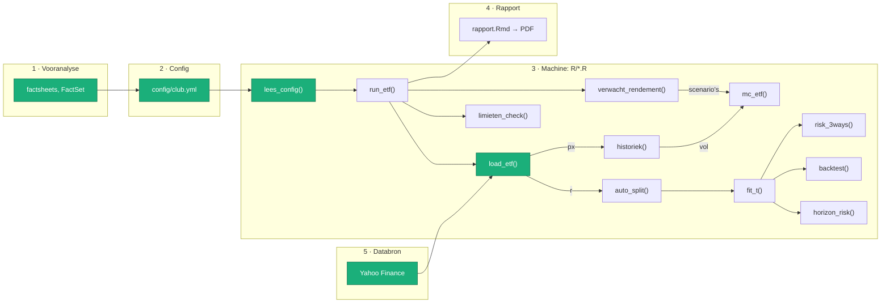

# ETF-model in R

Een algoritme dat elke ETF analyseert voor Le Gradient.

# Diagram (via mermaid)

```mermaid
flowchart LR
  subgraph A["1 · Vooranalyse"]
    S["factsheets, FactSet"]
  end
  subgraph B["2 · Config"]
    Y["config/club.yml"]
  end
  subgraph C["3 · Machine: R/*.R"]
    LC["lees_config()"]
    RE["run_etf()"]
    LE["load_etf()"]
    HI["historiek()"]
    VR["verwacht_rendement()"]
    MC["mc_etf()"]
    AS["auto_split()"]
    FT["fit_t()"]
    RK["risk_3ways()"]
    BT["backtest()"]
    HR["horizon_risk()"]
    LM["limieten_check()"]
  end
  subgraph D["4 · Rapport"]
    RP["rapport.Rmd → PDF"]
  end
  subgraph E["5 · Databron"]
    YH["Yahoo Finance"]
  end
  S --> Y --> LC --> RE
  RE --> LE
  LE -->|px| HI
  YH --> LE
  RE --> VR -->|scenario's| MC
  HI -->|vol| MC
  LE -->|r| AS --> FT
  FT --> RK
  FT --> BT
  FT --> HR
  RE --> LM
  RE --> RP
  classDef klaar fill:#1BAF7A,color:#fff,stroke:#0d6b4a
  class LC,LE,YH,Y,S klaar
```